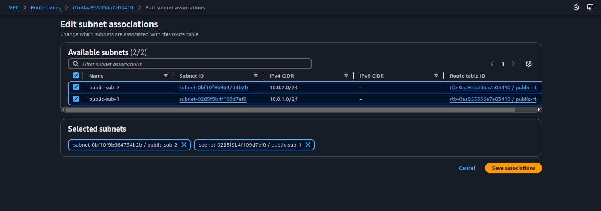
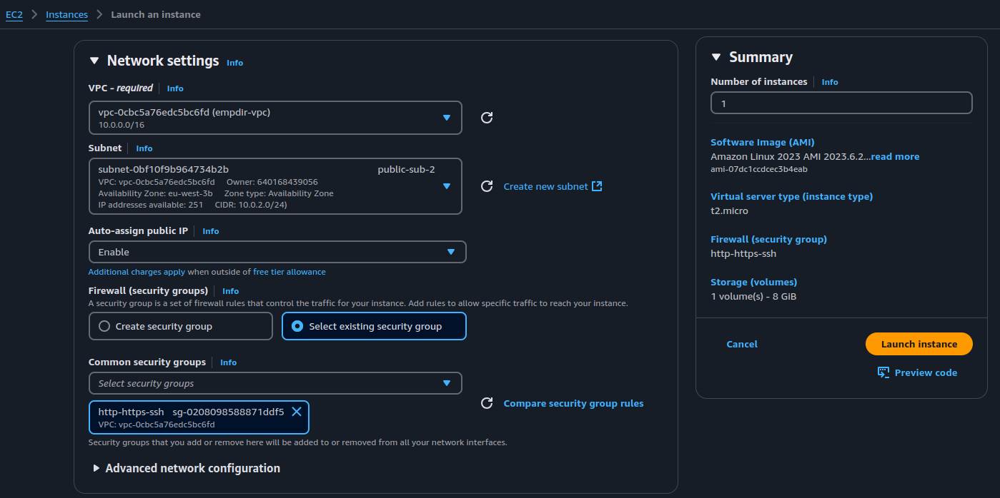
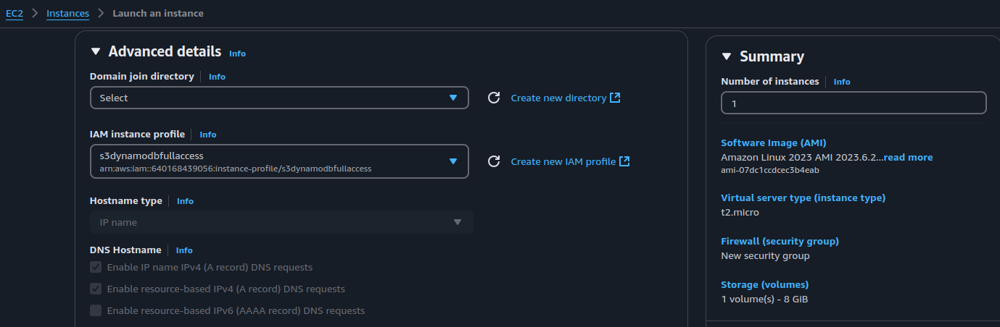
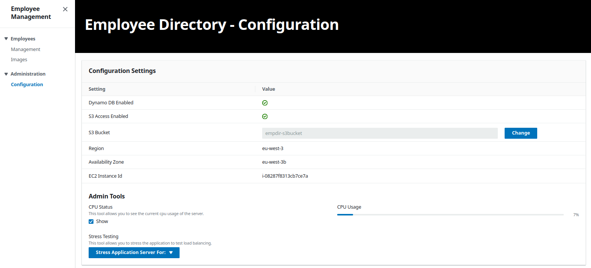
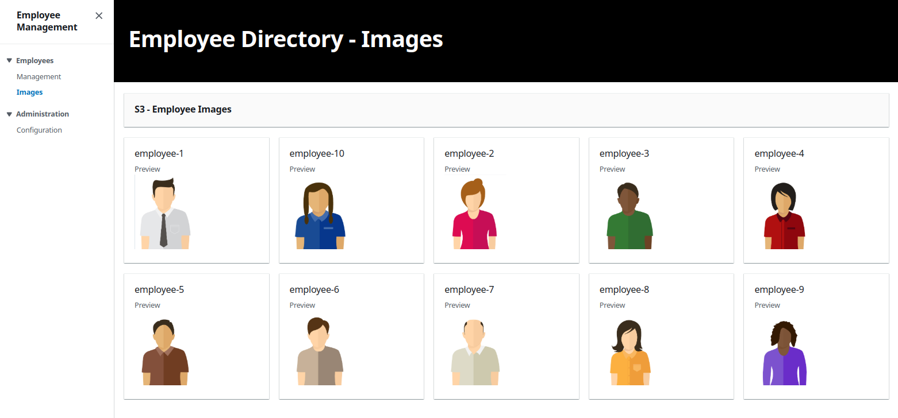

# Employee directory app on aws

A simple and scalable employee directory application deployed on AWS. 
The app allows you to view and manage employee information along with photos stored in an S3 bucket and data stored in DynamoDB. 
It runs as a Docker container on an EC2 instance.

- [Prerequisites](#prerequisites-)
- [Dockerizing the app](#dockerizing-the-app-)
- [Deploying on AWS](#deploying-on-aws-)
    - [Setting up a VPC](#setting-up-a-vpc-)
    - [Configuring IAM roles and security groups](#configuring-iam-roles-and-security-groups-)
    - [Setting up S3 and DynamoDB](#setting-up-s3-and-dynamodb-)
    - [Launching an EC2 instance](#launching-an-ec2-instance-)
- [Results](#results-)

## Prerequisites :

* an AWS account (Free tier)
* Docker

## Dockerizing the app :

* added the necessary environment variables to the `.env` file <a href="./env.example">.env.example</a>

    ```
    NODE_ENV= "production ,development"
    PORT= "port number"
    AWS_PROFILE=default
    PHOTOS_BUCKET= "bucket-name"
    DEFAULT_AWS_REGION= "region"
    TABLE_NAME= "name of the database table"
    ```

* built two docker file versions :

    - simplified version <a href="./dockerfile">dockerfile</a>
    - optimized version <a href="./dockerfile-optimized">dockerfile-optimized</a>

* the optimized version takes up less space but uses two stages unlike the simplified version, it also uses lightweight alpine images as base

    

    ```
    docker build . -f dockerfile-optimized -t hamdiz0/empdir-app
    ```
* pushed the optimized image version to dockerhub :

    ```
    docker push hamdiz0/empdir-app
    ```
## Deploying on AWS :

### Setting up a VPC :

* created a VPC with two subnets in two different avaibility zones

    

* added a Internet Gateway and attached it to the VPC allowing access to internet

    

* setup a Route Table for public access throught the created Internet Gateway

    

* associated the subnetes to the public Route Table

    

* created an Access List allowing both Inbound and Outbound traffic to the created subnets

    

### Configuring IAM roles and security groups :

* created an custom IAM role for the EC2 instance to grant full access to S3 along with DynamoDB

    

* added a security group to allow SSH, HTTP and HTTPS traffic

    

### Setting up S3 and DynamoDB :

* created an S3 bucket to store the employees images
* pre uploaded the <a href="./employee-img/" >employees images</a>

     

* added a policy to the bucket in the permissions tab

    ```
    {
        "Version":"2012-10-17",
        "Statement":[
            {
                "Sid":"AllowS3ReadAccess",
                "Effect":"Allow",
                "Principal": {
                    "AWS":"arn:aws:iam::<ACCOUNT-NUMBER>:role/<ROLE>"   // ensure only the IAM role can access the bucket
                },
                "Action":"s3:*",                                        // full access
                "Resource":[
                    "arn:aws:s3:::<BUCKET-NAME>",                       // allow operations on the bucket itself
                    "arn:aws:s3:::<BUCKET-NAME>/*"                      // allow opertaions on the bucket objects
                ]
            }
        ]
    }
    ```
* added CROS configuration to the bucket to avoid request issues

    ```
    [
        {
            "AllowedHeaders": ["*"],                                    // allow all headers
            "AllowedMethods": [                                         // allow GET ,POST and PUT http methods
                "GET",
                "POST",
                "PUT"
            ],
            "AllowedOrigins": ["*"],                                    // allow all traffic ,you can specify a specific url
            "ExposeHeaders": ["ETag"],
            "MaxAgeSeconds": 3000
        }
    ]
    ```

* added a DynamoDB table to store the employee information

    

### Launching an EC2 instance :

* launched the instance on a public subnet of the created VPC
* attached the security group

    

* added the "s3dynamodbfullaccess" role to the EC2

    

* added a script in the user data field to launch the app automaticly when the instance done creating 

    

* the script installs docker and launches the app as a container

    ```
    #!/bin/bash

    USER_NAME="ubuntu"

    # install docker
    curl -fsSL https://test.docker.com -o test-docker.sh
    sudo sh test-docker.sh
    sudo usermod -aG docker $USER_NAME
    newgrp docker

    # run the employee directory app as container
    sudo -u $USER_NAME docker run -p 80:80 -d --name=empdir hamdiz0/empdir-app
    ```

* a crontab expression can be added to strat the app on boot

    ```
    @reboot docker run -p 80:80 -d --name=empdir hamdiz0/empdir-app
    ```

* the app can be accessed throught http using the EC2 instance ip@

    ```
    http://<EC2_IP_ADDRESS>:80
    ```

## Results :

* Application






* DynamoDB table


* adding an employee with an uploaded image


