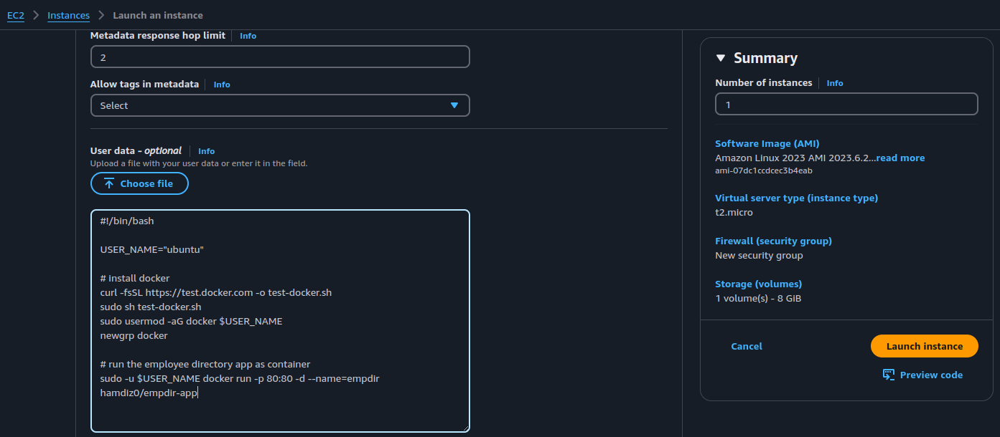
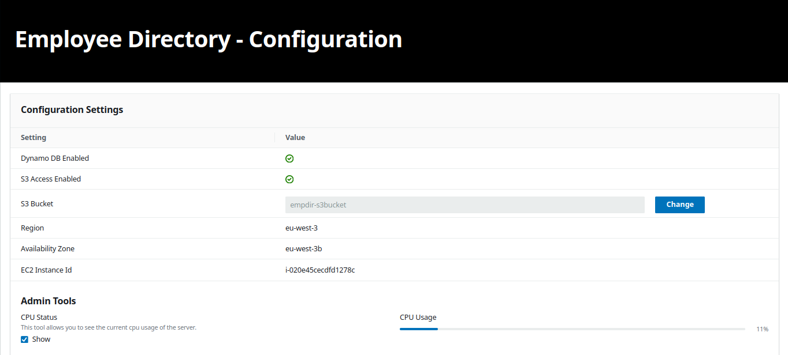

# Employee directory app on aws

A simple and scalable employee directory application deployed on AWS. 
The app allows you to view and manage employee information along with photos stored in an S3 bucket and data stored in DynamoDB. 
It runs as a Docker container on an EC2 instance.

- [Prerequisites](#prerequisites-)
- [Dockerizing the app](#dockerizing-the-app-)
- [Deploying on AWS](#deploying-on-aws-)
    - [Setting up a VPC](#setting-up-a-vpc-)
    - [Configuring IAM roles and security groups](#configuring-iam-roles-and-security-groups-)
    - [Setting up S3 and DynamoDB](#setting-up-s3-and-dynamodb-)
    - [Launching an EC2 instance](#launching-an-ec2-instance-)
- [Results](#results-)

## Prerequisites :

* an AWS account (Free tier)
* Docker

## Dockerizing the app :

* add the necessary environment variables to the `.env` file <a href="./env.example">.env.example</a>

    ```
    NODE_ENV= "production ,development"
    PORT= "port number"
    AWS_PROFILE=default
    PHOTOS_BUCKET= "bucket-name"
    DEFAULT_AWS_REGION= "region"
    TABLE_NAME= "name of the database table"
    ```

* created two docker file versions :

    - simplified version <a href="./dockerfile">dockerfile</a>
    - optimized version <a href="./dockerfile-optimized">dockerfile-optimized</a>

* the optimized version takes up less space but uses two stages unlike the simplified version, it also uses lightweight alpine images as base

    

    ```
    docker build . -f dockerfile-optimized -t hamdiz0/empdir-app
    ```
* pushed the optimized image version to dockerhub :

    ```
    docker push hamdiz0/empdir-app
    ```
## Deploying on AWS :

### Setting up a VPC :

* creata VPC with two subnets in two different avaibility zones

    

* add a Internet Gateway and attached it to the VPC allowing access to internet

    

* setup a Route Table for public access throught the created Internet Gateway

    

* associate the subnetes to the public Route Table

    

* create an Access List allowing both Inbound and Outbound traffic to the created subnets

    

### Configuring IAM roles and security groups :

* create an custom IAM role for the EC2 instance to grant full access to S3 along with DynamoDB

    

* add a security group to allow SSH (optional), HTTP and HTTPS traffic

    

### Setting up S3 and DynamoDB :

* create an S3 bucket to store the employees images
* pre upload the <a href="./employee-img/" >employees images</a> to the bucket for testing

     

* add a policy to the bucket in the permissions tab

    ```
    {
        "Version":"2012-10-17",
        "Statement":[
            {
                "Sid":"AllowS3ReadAccess",
                "Effect":"Allow",
                "Principal": {
                    "AWS":"arn:aws:iam::<ACCOUNT-NUMBER>:role/<ROLE>"   // ensure only the IAM role can access the bucket
                },
                "Action":"s3:*",                                        // full access
                "Resource":[
                    "arn:aws:s3:::<BUCKET-NAME>",                       // allow operations on the bucket itself
                    "arn:aws:s3:::<BUCKET-NAME>/*"                      // allow opertaions on the bucket objects
                ]
            }
        ]
    }
    ```
* add CROS configuration to the bucket to avoid request issues

    ```
    [
        {
            "AllowedHeaders": ["*"],                                    // allow all headers
            "AllowedMethods": [                                         // allow GET ,POST and PUT http methods
                "GET",
                "POST",
                "PUT"
            ],
            "AllowedOrigins": ["*"],                                    // allow all traffic ,you can specify a specific url
            "ExposeHeaders": ["ETag"],
            "MaxAgeSeconds": 3000
        }
    ]
    ```

* add a DynamoDB table to store the employee information

    

### Launching an EC2 instance :

* launch the instance on a public subnet of the created VPC
* attach the security group

    

* add the "s3dynamodbfullaccess" role to the EC2

    

* add a script in the user data field to launch the app automaticly when the instance done creating 

    

* the script installs docker and launches the app as a container

    ```
    #!/bin/bash

    USER_NAME="ubuntu"

    # install docker
    curl -fsSL https://test.docker.com -o test-docker.sh
    sudo sh test-docker.sh
    sudo usermod -aG docker $USER_NAME
    newgrp docker

    # run the employee directory app as container
    sudo -u $USER_NAME docker run -p 80:80 -d --name=empdir hamdiz0/empdir-app
    ```
* alternatively you can launch the app directly not as a docker container with the following script

    ```
    #!/bin/bash

    # Set environment variables
    export PORT="80"
    export PHOTOS_BUCKET="s3-bucket-name"
    export DEFAULT_AWS_REGION="region"
    export SHOW_ADMIN_TOOLS="1"

    # Update apt
    apt update -y

    # Install tools and dependencies
    apt install stress nodejs npm unzip -y

    # Create a dedicated directory for the application
    sudo mkdir -p /var/app
    cd /var/app

    # Download the app from S3
    wget https://aws-tc-largeobjects.s3-us-west-2.amazonaws.com/ILT-TF-100-TECESS-5/app/app.zip

    # Extract it to the desired folder
    sudo unzip app.zip -d /var/app/
    cd /var/app/

    # Install dependencies
    npm install

    # Start the app
    npm start
    ```
* a crontab expression can be added to strat the app on boot

    ```
    @reboot docker run -p 80:80 -d --name=empdir hamdiz0/empdir-app
    ```
    ```
    @reboot cd /var/app/ && npm start
    ```
* the app can be accessed throught http using the EC2 instance ip@

    ```
    http://<EC2_IP_ADDRESS>:80
    ```

## Auto Scaling :

### Setting up a Target Group :

* create a target group for the EC2 instances 
* add the VPC along with the disired health check settings

    
    


### Creating a Load Balancer :

* create an Application Load Balancer (ALB)

    

* add the VPC network and the created subnets along with the security group

    

* add the target group to the ALB

    

* the app can be accessed throught the ALB DNS name

    ```
    http://<ALB_DNS_NAME>
    ``

### Setting up  a launsh template :

* configure the template with the AMI from the previous EC2 instance along with network settings , IAM role and user data (launching script)

* make sure the auto assign public ip is enabled

    

### Creating an Auto Scaling Group :

* add the created launch template

   
   
* add the VPC with the desired availability zones

    

* attach the load balancer target group

    

* configue the scaling values to youre needs

    

* add a scaling policy to scale out and in based on the CPU usage

    

## Testing the Auto Scaling :

* the app has a built in stress feature that uses the stress linux utility to simulate high CPU usage

    

* target group before scaling

    

* target group after scaling

    

* the cpu usage drops drastically after the scaling

    
    
## Results :

* Application


* DynamoDB table


* adding an employee with an uploaded image


## Checkout my <a href="https://github.com/hamdiz0/LearningDevOps">LearningDevops</a> repo for more details about these tools and devops in general do not hesitate to contribute